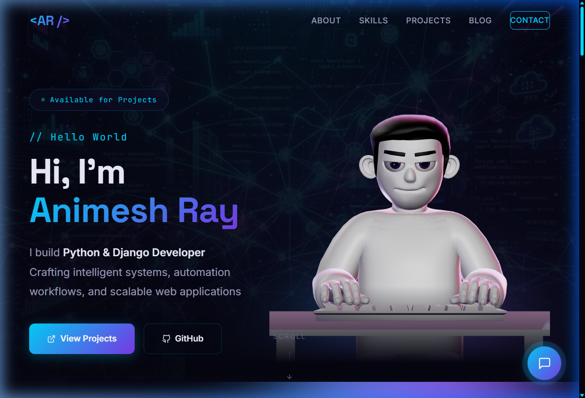

# Animesh Ray - Personal Portfolio 🚀

Welcome to the code repository for my personal portfolio website.

This project showcases my skills as an **AI Automation Developer** and **Software Engineer**. It features a modern, clean, dark-themed UI with integrated 3D elements, smooth scroll animations, and interactive components.



---

## ⚙️ Tech Stack

- **Framework**: React (Vite)
- **Language**: TypeScript
- **Styling**: Vanilla CSS (Custom Design System)
- **3D Rendering**: Three.js, React Three Fiber, WebGL
- **Animations**: GSAP (GreenSock)

---

## 👨‍💻 About Me

Hi, I'm **Animesh Ray**. I specialize in building intelligent workflows, scalable web applications, and AI-powered systems. 
I'm passionate about the intersection of Artificial Intelligence and software automation. 

- 🤖 **AI & Automation**: n8n, HuggingFace, OpenAI, Custom ML Pipelines
- 🌐 **Full-Stack Web**: Python, Django, React, Modern JavaScript

**Connect with me:**
- [GitHub](https://github.com/Animeshrayhub)
- [LinkedIn](https://www.linkedin.com/in/animeshray786/)

---

## 🚀 Running Locally

To run this project on your local machine:

1. Clone the repository:
   ```bash
   git clone https://github.com/Animeshrayhub/Animesh-portfolio.git
   ```
2. Navigate into the directory:
   ```bash
   cd Animesh-portfolio
   ```
3. Install dependencies:
   ```bash
   npm install
   ```
4. Start the development server:
   ```bash
   npm run dev
   ```

---

*Designed and Built by Animesh Ray*
